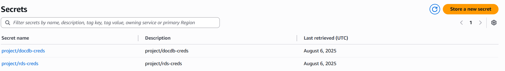

# 📊 Financial Data Warehouse & Batch ETL Pipeline

<div align="center">

[](https://aws.amazon.com/)
[](https://python.org/)
[](https://spark.apache.org/)
[](https://postgresql.org/)

</div>

> **🎯 Project Overview:** This project demonstrates the design and implementation of a robust, serverless batch ETL pipeline on AWS. It fulfills the requirements of the Data Engineer practical assignment by ingesting data from disparate sources (PostgreSQL and DocumentDB), transforming it into an analytics-ready star schema, and loading it into a modern data lakehouse where it can be queried by BI tools.

---

## 📋 Table of Contents

- [🏗️ Architecture](#️-architecture)
- [☁️ AWS Services Used](#️-aws-services-used)
- [⚙️ Setup Instructions](#️-setup-instructions)
- [📝 Code & Process Documentation](#-code--process-documentation)
- [✅ How to Use & Verify](#-how-to-use--verify)
- [🛡️ Data Quality & Governance](#️-data-quality--governance)
- [🚧 Challenges & Solutions](#-challenges--solutions)

---

## 🏗️ Architecture

The pipeline is built on a modern, serverless **"Data Lakehouse"** architecture. This design is highly scalable, resilient, and cost-effective as it separates storage (S3) from compute (Glue, Athena).

### 🔄 Data Flow

```
Source Databases (RDS, DocumentDB) 
    ⬇️
AWS DMS (Ingestion) 
    ⬇️
Amazon S3 (Raw Zone) 
    ⬇️
AWS Glue (Catalog & ETL) 
    ⬇️
Amazon S3 (Analytics Zone) 
    ⬇️
Amazon Athena (Querying)
```

### 📊 Architecture Components

| **Component** | **Service** | **Purpose** |
|---------------|-------------|-------------|
| **Source Databases** | Amazon RDS (PostgreSQL), DocumentDB | Relational and NoSQL data sources |
| **Ingestion Layer** | AWS DMS | Full load extraction with data type conversion |
| **Raw Data Lake** | Amazon S3 `/raw/` | Landing area for unaltered data |
| **Metadata Catalog** | AWS Glue Catalog | Queryable metadata layer |
| **Transformation** | AWS Glue ETL (PySpark) | Data cleaning and star schema modeling |
| **Analytics Warehouse** | Amazon S3 `/analytics/` | Final transformed tables |
| **Query Engine** | Amazon Athena | Serverless SQL interface |

---

## ☁️ AWS Services Used

<div align="center">

| Service | Purpose | Key Features |
|---------|---------|--------------|
|  | Relational data source | Managed PostgreSQL database |
|  | NoSQL data source | MongoDB-compatible document database |
|  | Extract phase | Production-grade heterogeneous data ingestion |
|  | Core storage layer | Raw data lake and analytics warehouse |
|  | Transformation | Serverless Spark environment and metadata catalog |
|  | User interface | Serverless SQL query engine |

</div>

### 🔐 Security & Infrastructure

- **AWS IAM**: Role-based access control
- **AWS Secrets Manager**: Secure credential storage
- **AWS VPC & Endpoints**: Isolated network with private endpoints

---

## ⚙️ Setup Instructions

### 1. 🔑 IAM Roles & Users

- **Create IAM Role for AWS Glue** (`Glue-Project-Role`)
  - Permissions: Glue, S3, and Secrets Manager
- **Ensure DMS IAM Role** (`dms-access-for-s3`)
  - Additional permission: `s3:DeleteObject`

### 2. 🌐 VPC & Endpoints

- ✅ Provision all resources within the  VPC
- ✅ Create VPC Endpoints:
  - **S3** (Gateway)
  - **STS** (Interface)
  - **Secrets Manager** (Interface)

### 3. 🗄️ Source Databases

#### PostgreSQL Setup
- Launch Amazon RDS for PostgreSQL instance


#### DocumentDB Setup
- Launch Amazon DocumentDB cluster


#### Connection Testing
- Test RDS connection using DBeaver


- Create jumpbox (EC2 instance) for DocumentDB access


#### Data Population
- Populate databases using scripts in `/Data_Loading`, and run from there
- You  copy  them using scp to your jumpbox EC2 instance:
  - **PostgreSQL**: run the create_postgres_schema.sql from your DBeaver  to create schema and then run the Populate_PostgreSQL
  - **DocumentDB**: Run the populate_docdb to populate

#### Initial Schema Verification


### 4. 🔐 Credential Management

Store database credentials in AWS Secrets Manager



### 5. 🔄 AWS DMS Setup

1. **Create DMS Replication Instance** within VPC
2. **Create Source Endpoints**:
   - RDS endpoint
   - DocumentDB endpoint (linked to Secrets Manager)
3. **Create Target Endpoint** pointing to S3 bucket
4. **Create and run migration tasks**:
   - `rds-to-s3-full-load`
   - `docdb-to-s3-full-load`


### 6. 🔍 AWS Glue & Athena Setup

#### Glue Database Creation
- Create Glue Database: `financial_data_db`

#### Data Cataloging
- Run `postgres-data-crawler` for relational data


- Manually create `transaction_events` table schema

#### ETL Job Creation
- Create `transform-to-star-schema` Glue ETL job
- Use script from `/glue_scripts/transform-to-star-schema.py`


#### Verify Analytics Tables


#### Final Cataloging
- Run `analytics-data-crawler`


#### Athena Configuration
- Configure S3 bucket for Athena query results

---

## 📝 Code & Process Documentation

### 🐍 Core ETL Script: `/glue_scripts/transform-to-star-schema.py`

#### **Phase 1: Load** 🔄
- Loads raw tables (`customers`, `accounts`, `transactions`) from Glue Catalog
- For DocumentDB data: bypasses catalog, reads directly from S3 with manual schema

#### **Phase 2: Transform** ⚙️
Creates star schema tables:

| **Table Type** | **Table Name** | **Description** |
|----------------|----------------|-----------------|
| **Dimensions** | `dim_customers` | Customer information |
|                | `dim_accounts` | Account details |
|                | `dim_dates` | Generated date dimension |
| **Facts** | `fact_transactions` | Transaction facts with foreign keys |

#### **Phase 3: Load** 💾
- Writes DataFrames to `/analytics/` S3 path in Parquet format
- Implements overwrite strategy for idempotency

---

## ✅ How to Use & Verify

### 🔍 Query Verification Steps

1. **Navigate to Amazon Athena** in AWS Console
2. **Select database**: `financial_data_db`
3. **Verify tables**: `dim_customers`, `dim_accounts`, `dim_dates`, `fact_transactions`

### 📊 Sample Analytical Query

```sql
-- Find the total transaction amount per customer
SELECT
  c.name,
  c.email,
  SUM(f.amount) AS total_transaction_amount
FROM fact_transactions AS f
JOIN dim_customers AS c
  ON f.customer_key = c.customer_key
GROUP BY
  c.name,
  c.email
ORDER BY
  total_transaction_amount DESC;
```


---

## 🛡️ Data Quality & Governance

### 📈 Data Quality Measures

| **Aspect** | **Implementation** | **Benefit** |
|------------|-------------------|-------------|
| **Schema Enforcement** | Schema-on-write approach | Ensures data structure consistency |
| **Relational Integrity** | JOIN operations in ETL | Maintains referential integrity |
| **Manual Schema Control** | DocumentDB schema definition | Guarantees transformation accuracy |

### 🔒 Data Governance Framework

#### Security
- **🔐 Private VPC**: Isolated network environment
- **🛡️ VPC Endpoints**: Secure service communication
- **👤 IAM Roles**: Least-privilege permissions

#### Compliance
- **🔒 PII Processing**: Within Glue ETL job
- **⚖️ Regulation Ready**: GDPR/POPIA compliance capabilities
- **🛡️ Data Masking**: Tokenization and hashing support

---

## 🚧 Challenges & Solutions

### 🔴 Challenge 1: No Access to Redshift on Free Tier
**Problem**: Redshift could not be used as the Datawarehouse
```
❌ Initial plan: Redshift as a Data Warehouse
✅ Solution: Pivoted to uilding a Data Lakehouse using S3 for storage and Athena as a query engine
```

### 🔴 Challenge 2: Schema Discovery Issues
**Problem**: Glue Crawler couldn't interpret DocumentDB Parquet schema
```
❌ Crawler approach: Unreliable schema detection
✅ Manual approach: Direct schema definition in PySpark
```
**Resolution Method**: Bypassed problematic component with manual control

---

<div align="center">

### 🎉 **Pipeline Status: Complete & Operational**

[](/)
[](/)
[](/)

</div>

---

*This documentation demonstrates a production-ready, scalable data engineering solution that successfully overcomes real-world technical challenges through systematic problem-solving and architectural best practices.*