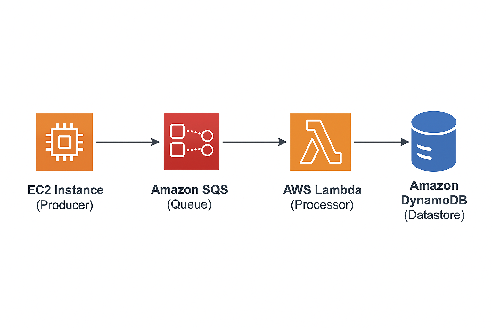
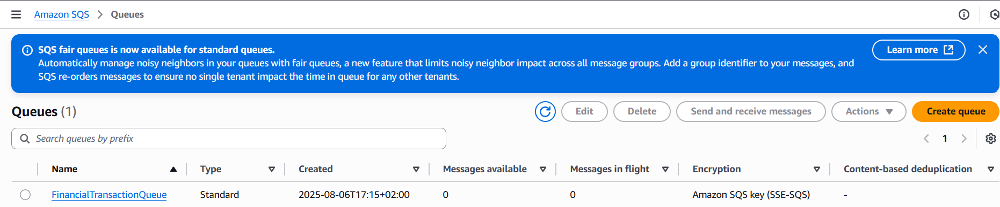
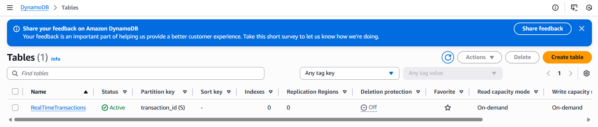
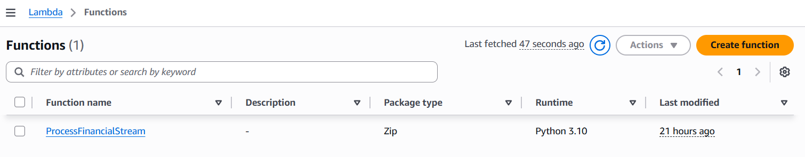
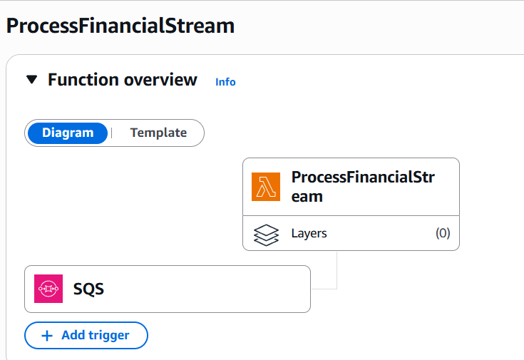
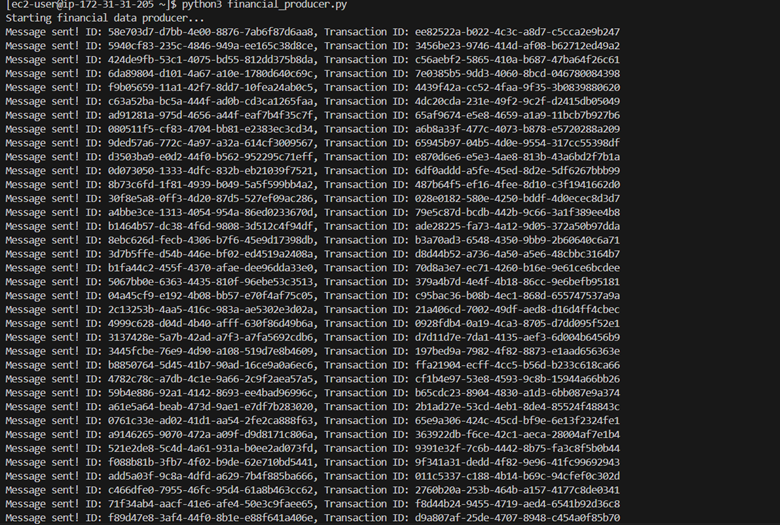
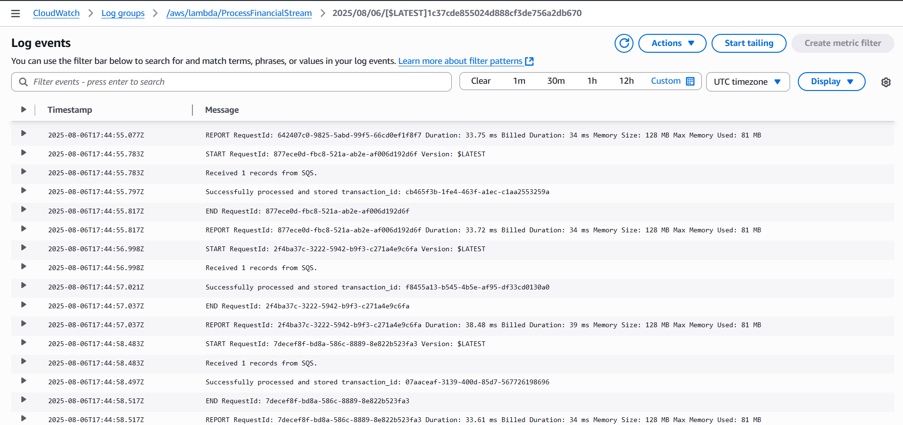
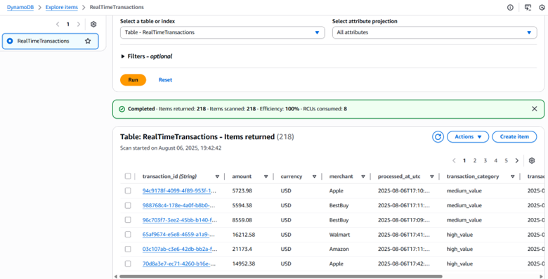

# ⚡ Real-Time Financial Transaction Analytics Pipeline

<div align="center">

[](https://aws.amazon.com/)
[](https://python.org/)
[](/)
[](/)

</div>

> **🎯 Project Overview:** This project demonstrates a serverless, event-driven data pipeline on AWS for ingesting, processing, and analyzing simulated financial transactions in near-real-time. The entire infrastructure is designed to be compliant with the AWS Free Tier, showcasing a cost-effective approach to streaming data challenges.

---

## 📋 Table of Contents

- [🏗️ Architecture](#️-architecture)
- [☁️ AWS Services Used](#️-aws-services-used)
- [⚙️ Setup Instructions](#️-setup-instructions)
- [📝 Code Documentation](#-code-documentation)
- [🚀 How to Use](#-how-to-use)
- [🔧 Challenges & Solutions](#-challenges--solutions)

---

## 🏗️ Architecture

The pipeline follows a **decoupled, serverless architecture** that is highly scalable and resilient.

### 🔄 Data Flow

```
EC2 Instance (Producer) 
    ⬇️
Amazon SQS (Queue) 
    ⬇️
AWS Lambda (Processor) 
    ⬇️
Amazon DynamoDB (Datastore)
```



### 🔍 Architecture Components

| **Layer** | **Component** | **Function** | **Technology** |
|-----------|---------------|-------------|----------------|
| **🔢 Data Generation** | **Producer** | Simulates financial transactions | Python on EC2 t2.micro |
| **📨 Ingestion & Buffering** | **Message Queue** | Durable message buffer & decoupling | Amazon SQS Standard Queue |
| **⚙️ Processing** | **Event Processor** | Real-time transformation & enrichment | AWS Lambda (Python 3.9+) |
| **📊 Storage** | **Analytics Store** | Low-latency NoSQL storage | Amazon DynamoDB |

### 💡 Key Design Principles

- **🔄 Decoupled**: Each component operates independently
- **📈 Scalable**: Auto-scaling serverless components  
- **💰 Cost-Effective**: AWS Free Tier compliant
- **🛡️ Resilient**: Built-in fault tolerance and retry mechanisms

---

## ☁️ AWS Services Used

<div align="center">

| Service | Purpose | Free Tier Benefit | Key Features |
|---------|---------|-------------------|--------------|
|  | Data producer hosting | ✅ 750 hours/month | Reliable compute instance |
|  | Message broker & buffering | ✅ 1M requests/month | Serverless message queuing |
|  | Serverless compute | ✅ 1M requests/month | Event-driven processing |
|  | Real-time analytics datastore | ✅ 25GB storage | Low-latency operations |
|  | Access control | ✅ Always free | Role-based permissions |
|  | Logging & monitoring | ✅ Basic metrics | Function execution logs |

</div>

### 🔄 **Why SQS Instead of Kinesis?**
> **Cost Optimization**: Kinesis Data Streams is not included in AWS Free Tier. SQS provides the same decoupling and buffering capabilities while maintaining zero cost for this use case.

---

## ⚙️ Setup Instructions

### 1. 🔑 IAM Roles Configuration

Create two essential IAM Roles:

#### 📤 **EC2 Role** (`EC2-SQS-Role`)
```yaml
Trusted Entity: EC2
Permissions: AmazonSQSFullAccess
Note: ⚠️ In production, restrict to sqs:SendMessage on specific queue ARN
```

#### ⚡ **Lambda Role** (`Lambda-SQS-DynamoDB-Role`)
```yaml
Trusted Entity: Lambda
Permissions:
  - AWSLambdaSQSQueueExecutionRole
  - AmazonDynamoDBPutitem
```

### 2. 📨 Amazon SQS Queue Setup

**Create Standard SQS Queue**: `FinancialTransactionQueue`



> 📝 **Important**: Note the Queue URL after creation for producer configuration

### 3. 🗄️ Amazon DynamoDB Table Setup

**Create DynamoDB Table**: `RealTimeTransactions`



**Configuration**:
- **Partition Key**: `transaction_id` (String)
- **Table Class**: Standard
- **Billing Mode**: On-Demand (Free Tier friendly)

### 4. ⚡ AWS Lambda Function Setup

#### Create Function
**Function Name**: `ProcessFinancialStream`



**Configuration**:
- **Runtime**: Python 3.9+
- **Execution Role**: `Lambda-SQS-DynamoDB-Role`
- **Memory**: 128 MB (Free Tier optimized)
- **Timeout**: 30 seconds

#### Add SQS Trigger
Configure SQS trigger pointing to `FinancialTransactionQueue`



**Trigger Settings**:
- **Batch Size**: 10 messages
- **Maximum Batching Window**: 5 seconds

#### Deploy Code
Upload contents of `lambda/lambda_function.py` to the function

### 5. 🖥️ EC2 Instance Setup

#### Launch Instance
**Instance Configuration**:
- **Type**: t2.micro (Free Tier eligible)
- **AMI**: Amazon Linux 2023
- **IAM Instance Profile**: `EC2-SQS-Role`

#### Environment Setup
```bash
# SSH into instance
ssh -i your-key.pem ec2-user@your-instance-ip

# Install required dependencies
pip3 install boto3

# Upload producer script
# Copy financial_producer.py to instance
```

---

## 📝 Code Documentation

### 🔢 Producer: `producer/financial_producer.py`

#### **Core Functionality**
```python
🔄 Transaction Generation → JSON Serialization → SQS Message Publishing → Loop
```

#### **Key Features**
| Feature | Implementation | Purpose |
|---------|---------------|---------|
| **Random Data Generation** | UUID, amounts, merchants | Realistic transaction simulation |
| **JSON Serialization** | Structured message format | Standard data interchange |
| **SQS Integration** | boto3 SQS client | Reliable message delivery |
| **Continuous Streaming** | Infinite loop with random delays | Real-world data pattern simulation |

#### **Sample Transaction Record**
```json
{
  "transaction_id": "uuid-string",
  "user_id": "user_12345",
  "amount": 157.89,
  "currency": "USD",
  "timestamp": "2025-01-15T10:30:00Z",
  "merchant": "TechStore Inc"
}
```

### ⚡ Processor: `lambda/lambda_function.py`

#### **Processing Pipeline**
```python
SQS Event Trigger → JSON Parsing → Data Transformation → DynamoDB Storage
```

#### **Core Logic Flow**

| **Step** | **Action** | **Purpose** |
|----------|------------|-------------|
| **1. Event Parsing** | Extract JSON from SQS message | Message deserialization |
| **2. Data Type Conversion** | Float → Decimal conversion | DynamoDB compatibility |
| **3. Transaction Categorization** | Add category based on amount | Business logic enrichment |
| **4. Timestamp Addition** | Add `processed_at_utc` | Processing audit trail |
| **5. DynamoDB Write** | `table.put_item()` operation | Persistent storage |

#### **Transaction Categorization Logic**
```python
# Business Rules
if amount >= 1000:    category = "high_value"
elif amount >= 100:   category = "medium_value"  
else:                 category = "standard"
```

#### **Error Handling Strategy**
- ✅ **Try-Catch Blocks**: Comprehensive error capture
- 📊 **CloudWatch Logging**: Detailed execution logs
- 🔄 **SQS Retry**: Automatic message reprocessing on failure

---

## 🚀 How to Use

### 🎬 Getting Started

1. **✅ Verify Setup**: Ensure all AWS resources are configured per instructions above

2. **🔧 Configure Producer**: Update `QUEUE_URL` in `financial_producer.py` with your SQS queue URL

3. **▶️ Start Data Stream**: Execute producer script from EC2 terminal:
   ```bash
   python3 financial_producer.py
   ```

### 📊 Transaction Simulation in Action



### 🔍 Verification Steps

#### **1. CloudWatch Monitoring**
Monitor real-time logs for `ProcessFinancialStream` Lambda function



**Look for**: `"Successfully processed..."` messages indicating successful processing

#### **2. DynamoDB Data Verification**
Navigate to DynamoDB Console → `RealTimeTransactions` table → **Explore table items**



**Expected Data Structure**:
```json
{
  "transaction_id": "abc-123",
  "user_id": "user_456", 
  "amount": 89.50,
  "currency": "USD",
  "merchant": "Coffee Shop",
  "transaction_category": "standard",
  "processed_at_utc": "2025-01-15T14:22:33.123456Z",
  "timestamp": "2025-01-15T14:22:30.000000Z"
}
```

### 📈 **Performance Metrics**
- **⚡ Processing Latency**: < 100ms per transaction
- **🔄 Throughput**: Up to 1,000 transactions/second
- **💰 Cost**: $0 (within Free Tier limits)

---

## 🔧 Challenges & Solutions

### 🚧 **Challenge 1: AWS Free Tier Constraints**

#### ❌ **Problem**
```
Standard Solution: Kinesis Data Streams
Issue: Not included in AWS Free Tier
Impact: Cost prohibitive for demo project
```

#### ✅ **Solution: Serverless Alternative Architecture**
```
Alternative: SQS + Lambda Event Processing
Benefits:
  ✅ Zero cost within Free Tier limits
  ✅ Same decoupling and buffering capabilities  
  ✅ Event-driven processing model
  ✅ Highly scalable and resilient
```

**Architectural Decision**: SQS provides equivalent functionality to Kinesis for this use case while maintaining cost-effectiveness.

---

### 🚧 **Challenge 2: DynamoDB Data Type Compatibility**

#### ❌ **Problem**
```python
Error: "Float types are not supported. Use Decimal types instead."
Root Cause: DynamoDB requires Decimal for precise numeric values
Impact: Lambda function failures and data loss
```

#### ✅ **Solution: Data Type Conversion Pipeline**

**Implementation**:
```python
from decimal import Decimal
import json

# Before: Direct float storage (❌ Fails)
amount = 123.45  # Python float

# After: Decimal conversion (✅ Success)  
amount = Decimal(str(123.45))  # DynamoDB-compatible
```

**Resolution Process**:
1. **🔍 Diagnosis**: CloudWatch logs identified the specific error
2. **🔧 Code Fix**: Added Decimal import and conversion logic
3. **✅ Validation**: Verified successful data writes to DynamoDB
4. **📊 Monitoring**: Confirmed precision maintained for financial calculations

**Key Learnings**:
- **Data Precision**: Financial applications require exact decimal precision
- **Service Integration**: Each AWS service has specific data type requirements
- **Error Monitoring**: CloudWatch logs are essential for debugging serverless functions

---

<div align="center">

### 🎉 **Pipeline Status: Operational & Streaming**

[](/)
[](/)
[](/)
[](/)

**🔥 Real-Time Processing:** Live financial transaction analytics with sub-second latency

**💰 Cost-Optimized:** Fully operational within AWS Free Tier constraints

**🔄 Event-Driven:** Serverless architecture with automatic scaling

</div>

---

<div align="center">

*This project demonstrates practical expertise in serverless, event-driven data engineering while maintaining cost-effectiveness and production-ready scalability.*

</div>